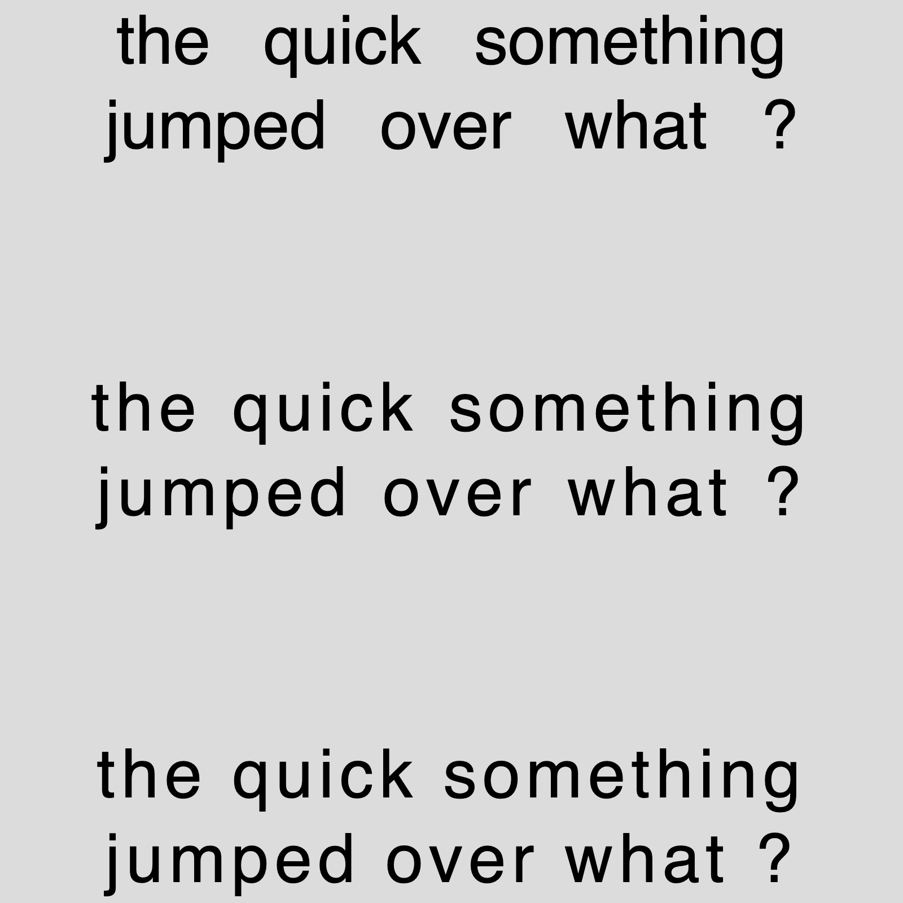

# p5.TextSpacing



Taking advantage of the built-it functions in the webCanvas 2D drawing context that let us interact with the spacing of words and letter within a string in p5.js. The direction is set by the text alignement. Works with imported font and CSS fonts aswell.

Either clone this repository or just grab the functions in the `src` folder.

## Important

This works only in 2D because the function are native to the 2D drawing context API. It can be done in 3D but it would require a totally different setup.

## Methods

``` js
 function wordSpacing(space:number)
```
Space the words in a string by the given amount of pixels

``` js
 function letterSpacing(space:number)
```
Space the letters in a string by the given amount of pixels